# 🚀 Kubernetes Deployment Scaling Mastery

[](https://github.com/TheToriqul/k8s-scale-deployment)


## 📋 Project Overview

This project demonstrates the implementation of Kubernetes deployment scaling, focusing on managing containerized Nginx applications effectively. Through this implementation, I showcase how to handle dynamic workload requirements by adjusting the number of running pods while maintaining application availability and performance.

## 🎯 Key Objectives

- Implement and manage Kubernetes deployments
- Master manual scaling operations in Kubernetes
- Monitor deployment and pod status effectively
- Understand ReplicaSet behavior during scaling
- Practice efficient container orchestration

## 🏗️ Project Architecture

```mermaid
graph LR
    subgraph Initial["Initial State"]
        D1["⎈ Deployment"] -->|Controls| P1["📦 Pod"]
        D1 -->|Controls| P2["📦 Pod"]
        D1 -->|Controls| P3["📦 Pod"]
    end

    subgraph ScaleUp["Scale Up (5 replicas)"]
        D2["⎈ Deployment"] -->|Controls| P4["📦 Pod"]
        D2 -->|Controls| P5["📦 Pod"]
        D2 -->|Controls| P6["📦 Pod"]
        D2 -->|Controls| P7["📦 Pod"]
        D2 -->|Controls| P8["📦 Pod"]
    end

    subgraph ScaleDown["Scale Down (2 replicas)"]
        D3["⎈ Deployment"] -->|Controls| P9["📦 Pod"]
        D3 -->|Controls| P10["📦 Pod"]
    end

    Initial -->|Scale up to 5 replicas| ScaleUp
    Initial -->|Scale down to 2 replicas| ScaleDown

    style D1 fill:#326CE5,color:white,stroke-width:2px
    style D2 fill:#326CE5,color:white,stroke-width:2px
    style D3 fill:#326CE5,color:white,stroke-width:2px
```



The architecture demonstrates how the Kubernetes Deployment Controller manages a ReplicaSet, which in turn controls the individual Nginx pods. When scaling operations are performed, the ReplicaSet automatically creates or removes pods to match the desired state.

## 💻 Technical Stack

- **Orchestration**: Kubernetes (for container orchestration)
- **Container**: Docker
- **Application**: Nginx web server
- **Image**: nginx:latest

## 🚀 Getting Started

<details>
<summary>🐳 Prerequisites</summary>

- Kubernetes cluster (minikube, kind, or cloud-based cluster)
- kubectl CLI tool
- Docker runtime
- Basic understanding of container concepts
</details>

<details>
<summary>⚙️ Installation</summary>

1. Clone the repository:
   ```bash
   git clone https://github.com/TheToriqul/k8s-scale-deployment.git
   ```
2. Navigate to the project directory:
   ```bash
   cd k8s-scale-deployment
   ```
</details>

<details>
<summary>🎮 Usage</summary>

1. Create the initial deployment:
   ```bash
   kubectl create deployment nginx-deployment --image=nginx:latest --replicas=3 --port=80
   ```
2. Scale the deployment:
   ```bash
   kubectl scale deployment nginx-deployment --replicas=5
   ```
3. Verify scaling:
   ```bash
   kubectl get pods -l app=nginx-deployment
   ```

For complete command reference, see [reference-commands.md](reference-commands.md).
</details>

## 💡 Key Learnings

### Technical Mastery:
1. Kubernetes deployment lifecycle management
2. Scaling strategies and implementation
3. Pod replica management
4. Deployment state verification
5. Resource monitoring during scaling operations

### Professional Development:
1. Infrastructure scaling principles
2. Container orchestration practices
3. Command-line operations
4. Resource management strategies
5. System state monitoring

### 🔄 Future Enhancements

<details>
<summary>View Planned Improvements</summary>

1. Implement Horizontal Pod Autoscaling (HPA)
2. Add resource requests and limits
3. Implement readiness and liveness probes
4. Add service configuration
5. Implement rolling update strategies
</details>

## 🙌 Contribution

Contributions are welcome! Feel free to [open an issue](https://github.com/TheToriqul/k8s-scale-deployment/issues) or submit a [pull request](https://github.com/TheToriqul/k8s-scale-deployment/pulls).

## 📧 Connect with Me

- 📧 Email: toriqul.int@gmail.com
- 📱 Phone: +65 8936 7705, +8801765 939006
- 🌐 LinkedIn: [@TheToriqul](https://www.linkedin.com/in/thetoriqul/)
- 🐙 GitHub: [@TheToriqul](https://github.com/TheToriqul)
- 🌍 Portfolio: [TheToriqul.com](https://thetoriqul.com)

## 👏 Acknowledgments

- [Poridhi for providing comprehensive labs and inspiring this project](https://devops.poridhi.io/)
- The Kubernetes community for excellent documentation
- Fellow DevOps engineers for valuable feedback

---

Thank you for exploring this repository! I hope you find it helpful for understanding Kubernetes deployment scaling. Happy containerizing! 🚀